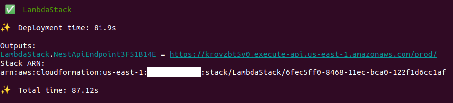
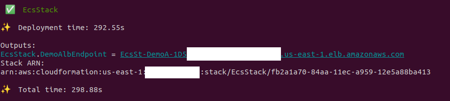

# Sample NestJS Deployment as AWS Lambda and ECS Service

## Goal

This project demonstrates how the same NestJS codebase can be deployed both as AWS Lambda and ECS Fargate Service.

## Project Structure

This repository contains two folders:
- backend folder with NestJS application
- deployment folder with CDK application which can deploy the application above both as AWS Lambda (integrated with API Gateway) and ECS Fargate Service (behind Application Load Balancer)

## Deployment as AWS Lambda

### Build NestJS app and copy dependencies
```
$ cd backend; npm i
$ npm run build
$ npm run build:layer
```

### Deploy

``` 
$ cd ../deployment; npm i
$ cdk deploy LambdaStack
```

API Gateway Endpoint URL can be copied from the stack output:


### Test

Send the test request:

```
$ curl https://kroyzbt5y0.execute-api.us-east-1.amazonaws.com/prod/app/hello

Hello World!
```


## Deployment as ECS Service

### Deploy

``` 
$ cd deployment; npm i
$ cdk deploy EcsStack
```

ALB endpoint hostname can be copied from the stack output:


### Test

Send the test request:

```
$ curl http://EcsSt-DemoA-1D5N*********.us-east-1.elb.amazonaws.com:3000/app/hello

Hello World!
```

DISCLAIMER: This project, code samples and the documentation are provided "as is" without warranty of any kind, either express or implied. Use at your own risk.

We make makes no warranty that

- the software will meet your requirements
- the software will be uninterrupted, timely, secure or error-free
- the results that may be obtained from the use of the software will be effective, accurate or reliable
- the quality of the software will meet your expectations
- any errors in the software obtained from us will be corrected.

We assume no responsibility for errors or omissions in the software or documentation.